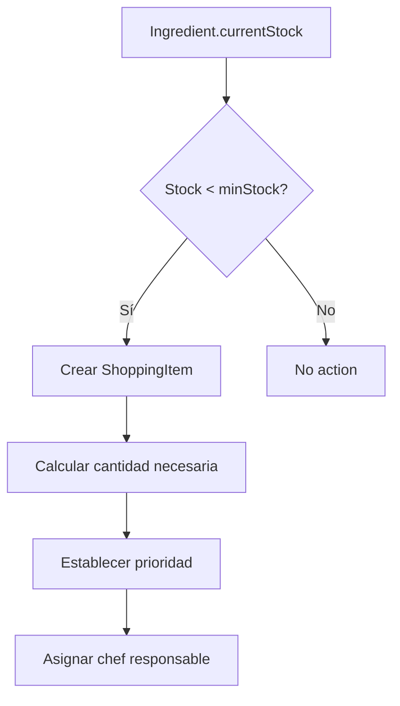
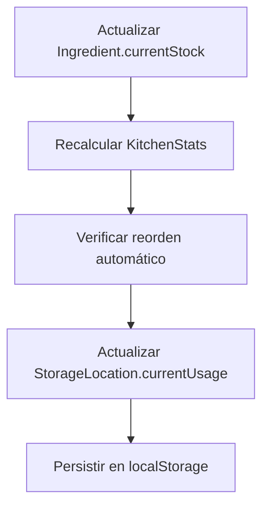

# 🗄️ Base de Datos - Küchen-Inventar

## 📋 Descripción General

Küchen-Inventar es un sistema de gestión de inventario para cocinas profesionales que utiliza **localStorage** como base de datos local y está preparado para integración con **Supabase** (PostgreSQL en la nube).

## 🏗️ Arquitectura de Datos

### Estructura Principal

El sistema está organizado en **5 entidades principales** que se relacionan entre sí:

```
┌─────────────┐    ┌─────────────┐    ┌─────────────┐
│    Chef     │    │ Ingredient  │    │   Storage   │
│             │◄───┤             │◄───┤  Location   │
└─────────────┘    └─────────────┘    └─────────────┘
       │                   │
       │                   │
       ▼                   ▼
┌─────────────┐    ┌─────────────┐
│    Dish     │    │   Shopping  │
│             │    │    Item     │
└─────────────┘    └─────────────┘
```

## 🧑‍🍳 Entidad: Chef

**Propósito**: Gestionar los chefs responsables de diferentes áreas de la cocina.

```typescript
interface Chef {
  id: string;           // Identificador único
  name: string;         // Nombre del chef
  specialty: string;    // Especialidad culinaria
  color: string;        // Color distintivo (HSL)
  avatar: string;       // Inicial o avatar
}
```

**Relaciones**:
- `1:N` con `Ingredient` (un chef puede ser responsable de múltiples ingredientes)
- `1:N` con `ShoppingItem` (un chef puede tener múltiples items en la lista de compras)

## 🥩 Entidad: Ingredient

**Propósito**: Gestionar todos los ingredientes del inventario con información detallada.

```typescript
interface Ingredient {
  // Identificación básica
  id: string;
  name: string;
  unit: string;
  
  // Gestión de stock
  currentStock: number;
  minStock: number;
  maxStock: number;
  
  // Información financiera
  estimatedPrice: number;
  
  // Relaciones
  responsibleChefId: string;
  storageLocationId: string;
  
  // Categorización
  category: 'meat' | 'fish' | 'vegetables' | 'dairy' | 'grains' | 'spices' | 'beverages' | 'frozen' | 'canned' | 'fresh';
  priority: 'low' | 'medium' | 'high' | 'critical';
  
  // Proveedores y trazabilidad
  supplier: string;
  barcode?: string;
  expiryDate?: Date;
  lastRestocked: Date;
  notes: string;
  
  // Condiciones de almacenamiento
  storageConditions: {
    temperature?: number;
    humidity?: number;
    lightSensitive: boolean;
    airtight: boolean;
  };
  
  // Gestión automática
  autoReorder: boolean;
  reorderPoint: number;
  leadTime: number;
  batchSize: number;
}
```

**Relaciones**:
- `N:1` con `Chef` (muchos ingredientes pueden ser responsabilidad de un chef)
- `N:1` con `StorageLocation` (muchos ingredientes pueden estar en una ubicación)
- `1:N` con `DishIngredient` (un ingrediente puede usarse en múltiples platos)
- `1:1` con `ShoppingItem` (un ingrediente puede generar un item de compra)

## 🏪 Entidad: StorageLocation

**Propósito**: Gestionar las diferentes ubicaciones de almacenamiento en la cocina.

```typescript
interface StorageLocation {
  id: string;
  name: string;
  type: 'refrigerator' | 'freezer' | 'pantry' | 'dry-storage' | 'wine-cellar' | 'spice-rack';
  description: string;
  capacity: number;
  currentUsage: number;
  temperature?: number;    // Para refrigeradores y congeladores
  humidity?: number;       // Para almacenamiento seco
  icon: string;            // Emoji representativo
  color: string;           // Color distintivo
}
```

**Relaciones**:
- `1:N` con `Ingredient` (una ubicación puede contener múltiples ingredientes)

## 🍽️ Entidad: Dish

**Propósito**: Gestionar los platos del menú y sus ingredientes.

```typescript
interface Dish {
  id: string;
  name: string;
  price: number;
  category: 'Hauptgerichte' | 'Vorspeisen' | 'Nachspeisen' | 'Getränke';
  ingredients: DishIngredient[];
}

interface DishIngredient {
  ingredientId: string;
  quantity: number;
}
```

**Relaciones**:
- `N:N` con `Ingredient` a través de `DishIngredient`

## 🛒 Entidad: ShoppingItem

**Propósito**: Gestionar la lista de compras generada automáticamente.

```typescript
interface ShoppingItem {
  ingredientId: string;
  name: string;
  unit: string;
  quantity: number;
  estimatedCost: number;
  priority: 'DRINGEND' | 'NORMAL';
  responsibleChefId: string;
  completed: boolean;
  
  // Propiedades adicionales
  storageLocationId: string;
  category: string;
  supplier: string;
  notes: string;
}
```

**Relaciones**:
- `1:1` con `Ingredient` (un item de compra corresponde a un ingrediente)
- `N:1` con `Chef` (muchos items pueden ser responsabilidad de un chef)
- `N:1` con `StorageLocation` (muchos items pueden ir a una ubicación)

## 📊 Entidad: KitchenStats

**Propósito**: Estadísticas agregadas del sistema para el dashboard.

```typescript
interface KitchenStats {
  criticalItems: number;        // Items con stock 0
  shoppingItems: number;        // Items pendientes de compra
  weeklyBudget: number;         // Presupuesto semanal
  weeklySpent: number;          // Gasto semanal
  activeChefs: number;          // Número de chefs activos
  
  // Estadísticas avanzadas
  storageUtilization: number;   // Porcentaje de uso del almacén
  expiringItems: number;        // Artículos próximos a caducar
  lowStockItems: number;        // Artículos con stock bajo
  totalInventoryValue: number;  // Valor total del inventario
}
```

## 🔄 Flujo de Datos

### 1. Generación Automática de Lista de Compras


### 2. Gestión de Stock


## 💾 Persistencia de Datos

### LocalStorage (Actual)
- **Ventajas**: Rápido, offline, sin configuración
- **Desventajas**: Limitado a 5-10MB, solo un navegador
- **Estructura**:
  ```javascript
  localStorage.setItem('kitchen-chefs', JSON.stringify(chefs));
  localStorage.setItem('kitchen-ingredients', JSON.stringify(ingredients));
  localStorage.setItem('kitchen-storage-locations', JSON.stringify(storageLocations));
  localStorage.setItem('kitchen-budget', weeklyBudget.toString());
  localStorage.setItem('kitchen-shopping', JSON.stringify(shoppingList));
  ```

### Supabase (Preparado)
- **Configuración actual**: `project_id = "tjopnfhzsufmdybtxipl"`
- **Ventajas**: Multi-usuario, backup automático, consultas SQL
- **Estructura preparada**: Todas las interfaces están listas para migración

## 🔍 Consultas Principales

### 1. Ingredientes Críticos
```typescript
const criticalItems = ingredients.filter(i => i.currentStock === 0);
```

### 2. Lista de Compras por Chef
```typescript
const chefShoppingList = shoppingList.filter(item => 
  item.responsibleChefId === chefId && !item.completed
);
```

### 3. Utilización de Almacén
```typescript
const storageUtilization = (totalUsage / totalCapacity) * 100;
```

### 4. Ingredientes por Caducar
```typescript
const expiringItems = ingredients.filter(i => 
  i.expiryDate && new Date(i.expiryDate) < new Date(Date.now() + 7 * 24 * 60 * 60 * 1000)
);
```

## 🚀 Migración a Supabase

### 1. Crear Tablas
```sql
-- Tabla de chefs
CREATE TABLE chefs (
  id UUID PRIMARY KEY DEFAULT gen_random_uuid(),
  name TEXT NOT NULL,
  specialty TEXT NOT NULL,
  color TEXT NOT NULL,
  avatar TEXT NOT NULL,
  created_at TIMESTAMP WITH TIME ZONE DEFAULT NOW()
);

-- Tabla de ubicaciones de almacenamiento
CREATE TABLE storage_locations (
  id UUID PRIMARY KEY DEFAULT gen_random_uuid(),
  name TEXT NOT NULL,
  type TEXT NOT NULL CHECK (type IN ('refrigerator', 'freezer', 'pantry', 'dry-storage', 'wine-cellar', 'spice-rack')),
  description TEXT,
  capacity INTEGER NOT NULL,
  current_usage INTEGER NOT NULL DEFAULT 0,
  temperature NUMERIC,
  humidity NUMERIC,
  icon TEXT NOT NULL,
  color TEXT NOT NULL,
  created_at TIMESTAMP WITH TIME ZONE DEFAULT NOW()
);

-- Tabla de ingredientes
CREATE TABLE ingredients (
  id UUID PRIMARY KEY DEFAULT gen_random_uuid(),
  name TEXT NOT NULL,
  unit TEXT NOT NULL,
  current_stock NUMERIC NOT NULL DEFAULT 0,
  min_stock NUMERIC NOT NULL DEFAULT 0,
  max_stock NUMERIC NOT NULL DEFAULT 0,
  estimated_price NUMERIC NOT NULL DEFAULT 0,
  responsible_chef_id UUID REFERENCES chefs(id),
  storage_location_id UUID REFERENCES storage_locations(id),
  category TEXT NOT NULL,
  priority TEXT NOT NULL CHECK (priority IN ('low', 'medium', 'high', 'critical')),
  supplier TEXT,
  barcode TEXT,
  expiry_date DATE,
  last_restocked DATE,
  notes TEXT,
  storage_conditions JSONB,
  auto_reorder BOOLEAN DEFAULT false,
  reorder_point NUMERIC,
  lead_time INTEGER,
  batch_size NUMERIC,
  created_at TIMESTAMP WITH TIME ZONE DEFAULT NOW()
);
```

### 2. Índices Recomendados
```sql
-- Índices para consultas frecuentes
CREATE INDEX idx_ingredients_chef ON ingredients(responsible_chef_id);
CREATE INDEX idx_ingredients_location ON ingredients(storage_location_id);
CREATE INDEX idx_ingredients_category ON ingredients(category);
CREATE INDEX idx_ingredients_stock ON ingredients(current_stock);
CREATE INDEX idx_ingredients_expiry ON ingredients(expiry_date);
```

## 📱 Consideraciones Mobile-First

### 1. Optimización de Consultas
- Usar `LIMIT` para listas largas
- Implementar paginación virtual
- Cachear datos frecuentemente accedidos

### 2. Sincronización Offline
- Usar localStorage como cache offline
- Sincronizar cuando haya conexión
- Manejar conflictos de datos

### 3. Performance
- Lazy loading de componentes
- Debounce en búsquedas
- Memoización de cálculos pesados

## 🔒 Seguridad y Validación

### 1. Validación de Datos
- Usar Zod para validación de esquemas
- Sanitizar inputs del usuario
- Validar tipos de datos antes de persistir

### 2. Autenticación
- Sistema de login implementado
- Roles de usuario (chef, admin)
- Protección de rutas sensibles

## 📈 Monitoreo y Analytics

### 1. Métricas Clave
- Tiempo de respuesta de consultas
- Uso de memoria del navegador
- Frecuencia de operaciones CRUD

### 2. Logs
- Operaciones de inventario
- Cambios de stock
- Acciones de usuarios

## 🎯 Próximos Pasos

1. **Implementar Supabase**: Migrar de localStorage a PostgreSQL
2. **Backup automático**: Configurar respaldos diarios
3. **API REST**: Crear endpoints para integración externa
4. **Webhooks**: Notificaciones automáticas de cambios
5. **Auditoría**: Log de todas las operaciones
