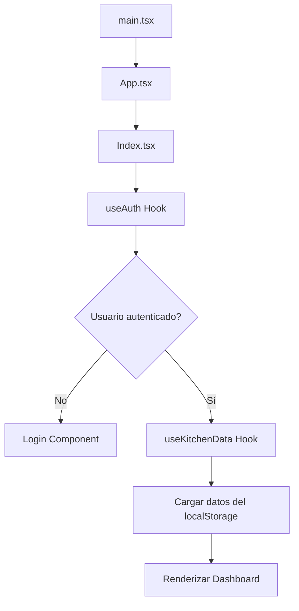
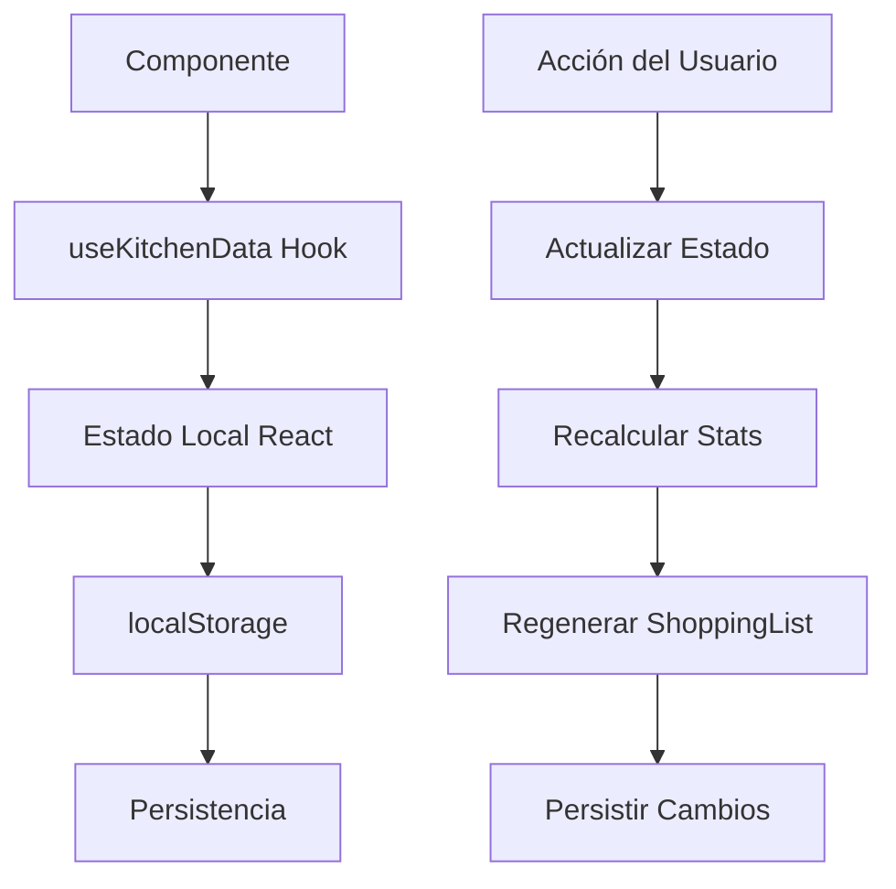
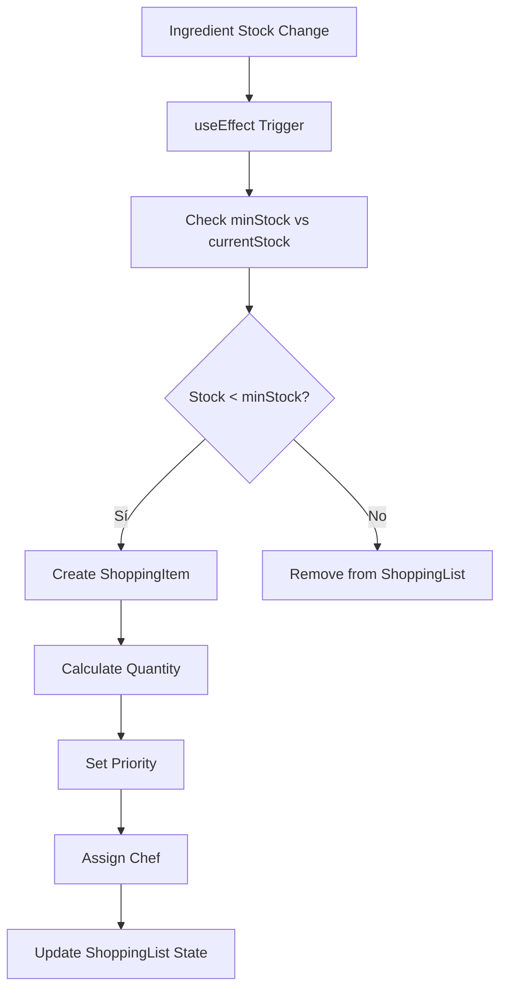

# 🗺️ Mapeo del Proyecto - Küchen-Inventar

## 📋 Descripción General

**Küchen-Inventar** es un sistema de gestión de inventario para cocinas profesionales desarrollado con React + TypeScript + Vite. El proyecto implementa una arquitectura modular con gestión de estado local y está preparado para escalabilidad con Supabase.

## 🏗️ Arquitectura del Sistema

```
┌─────────────────────────────────────────────────────────────┐
│                    PRESENTATION LAYER                      │
├─────────────────────────────────────────────────────────────┤
│  React Components (TSX) + Tailwind CSS + shadcn/ui        │
│  • Dashboard, Inventory, ShoppingList, ChefManagement     │
│  • Navigation, Login, SecurityWatermark                   │
│  • UI Components (Button, Dialog, Table, etc.)            │
└─────────────────────────────────────────────────────────────┘
                                │
                                ▼
┌─────────────────────────────────────────────────────────────┐
│                     BUSINESS LOGIC                         │
├─────────────────────────────────────────────────────────────┤
│  Custom Hooks + State Management                          │
│  • useKitchenData: Gestión centralizada de datos          │
│  • useAuth: Autenticación y autorización                  │
│  • useMobile: Detección de dispositivos móviles           │
│  • useToast: Notificaciones del sistema                   │
└─────────────────────────────────────────────────────────────┘
                                │
                                ▼
┌─────────────────────────────────────────────────────────────┐
│                      DATA LAYER                            │
├─────────────────────────────────────────────────────────────┤
│  • TypeScript Interfaces (kitchen.ts)                     │
│  • Initial Data (initialData.ts)                          │
│  • LocalStorage Persistence                                │
│  • Supabase Integration (Preparado)                       │
└─────────────────────────────────────────────────────────────┘
```

## 📁 Estructura de Directorios

```
kuechen-meister-plan/
├── 📁 src/                          # Código fuente principal
│   ├── 📁 components/               # Componentes React
│   │   ├── 📁 ui/                   # Componentes base (shadcn/ui)
│   │   ├── Dashboard.tsx            # Dashboard principal
│   │   ├── Inventory.tsx            # Gestión de inventario
│   │   ├── ShoppingList.tsx         # Lista de compras
│   │   ├── ChefManagement.tsx       # Gestión de chefs
│   │   ├── AdvancedIngredientManager.tsx # Gestor avanzado
│   │   ├── Navigation.tsx           # Navegación principal
│   │   ├── Login.tsx                # Sistema de autenticación
│   │   └── SecurityWatermark.tsx    # Marca de agua de seguridad
│   ├── 📁 hooks/                    # Hooks personalizados
│   │   ├── useKitchenData.ts        # Lógica de negocio principal
│   │   ├── useAuth.ts               # Autenticación
│   │   ├── use-mobile.tsx           # Detección móvil
│   │   └── use-toast.ts             # Sistema de notificaciones
│   ├── 📁 pages/                    # Páginas principales
│   │   ├── Index.tsx                # Página principal
│   │   └── NotFound.tsx             # Página 404
│   ├── 📁 types/                    # Definiciones TypeScript
│   │   └── kitchen.ts               # Interfaces del sistema
│   ├── 📁 data/                     # Datos iniciales
│   │   └── initialData.ts           # Datos de ejemplo
│   ├── 📁 lib/                      # Utilidades y configuraciones
│   ├── 📁 integrations/             # Integraciones externas
│   ├── App.tsx                      # Componente raíz
│   ├── main.tsx                     # Punto de entrada
│   └── index.css                    # Estilos globales
├── 📁 supabase/                     # Configuración Supabase
│   └── config.toml                  # ID del proyecto
├── 📁 public/                       # Archivos estáticos
├── 📁 dist/                         # Build de producción
├── package.json                     # Dependencias y scripts
├── tailwind.config.ts               # Configuración Tailwind
├── tsconfig.json                    # Configuración TypeScript
└── vite.config.ts                   # Configuración Vite
```

## 🔄 Flujo de Datos del Sistema

### 1. Inicialización de la Aplicación



### 2. Gestión de Estado



### 3. Generación Automática de Lista de Compras



## 🧩 Componentes Principales

### 1. **Dashboard** (`Dashboard.tsx`)
- **Propósito**: Vista general del sistema con estadísticas clave
- **Funcionalidades**:
  - Mostrar métricas del inventario
  - Resumen de chefs activos
  - Control de presupuesto semanal
  - Alertas de items críticos
- **Estado**: Lee `stats`, `chefs`, `ingredients`, `weeklyBudget`

### 2. **AdvancedIngredientManager** (`AdvancedIngredientManager.tsx`)
- **Propósito**: Gestión completa de ingredientes
- **Funcionalidades**:
  - CRUD de ingredientes
  - Movimiento entre ubicaciones
  - Gestión de stock
  - Filtros y búsquedas avanzadas
- **Estado**: Lee/escribe `ingredients`, `storageLocations`, `chefs`

### 3. **ShoppingList** (`ShoppingList.tsx`)
- **Propósito**: Lista de compras automática
- **Funcionalidades**:
  - Items organizados por chef
  - Marcado de completado
  - Cálculo de costos
  - Prioridades (DRINGEND/NORMAL)
- **Estado**: Lee/escribe `shoppingList`, `chefs`

### 4. **ChefManagement** (`ChefManagement.tsx`)
- **Propósito**: Administración de chefs
- **Funcionalidades**:
  - Crear/editar chefs
  - Asignar especialidades
  - Ver responsabilidades
  - Gestión de colores
- **Estado**: Lee/escribe `chefs`, `ingredients`, `shoppingList`

### 5. **Navigation** (`Navigation.tsx`)
- **Propósito**: Navegación entre secciones
- **Funcionalidades**:
  - Tabs principales
  - Contadores de alertas
  - Indicadores de estado
- **Estado**: Lee `activeTab`, `criticalItems`, `shoppingItems`

## 🪝 Hooks Personalizados

### 1. **useKitchenData** - Hook Principal
```typescript
// Funcionalidades principales:
- Gestión de estado para todas las entidades
- Persistencia automática en localStorage
- Cálculo de estadísticas en tiempo real
- Generación automática de lista de compras
- Operaciones CRUD para todas las entidades
```

**Estados gestionados**:
- `chefs`: Lista de chefs
- `ingredients`: Inventario completo
- `storageLocations`: Ubicaciones de almacenamiento
- `dishes`: Platos del menú
- `shoppingList`: Lista de compras
- `weeklyBudget`: Presupuesto semanal

### 2. **useAuth** - Autenticación
```typescript
// Funcionalidades:
- Login/logout de usuarios
- Verificación de autenticación
- Protección de rutas
- Gestión de sesiones
```

### 3. **useMobile** - Detección Móvil
```typescript
// Funcionalidades:
- Detección de dispositivos móviles
- Adaptación de UI según dispositivo
- Optimizaciones para touch
```

## 🔐 Sistema de Autenticación

### Flujo de Login
1. Usuario ingresa credenciales
2. `useAuth` valida credenciales
3. Se establece estado de autenticación
4. Se redirige al dashboard principal
5. `ProtectedRoute` protege rutas sensibles

### Estructura de Usuario
```typescript
interface User {
  username: string;
  role: 'chef' | 'admin' | 'manager';
  permissions: string[];
}
```

## 📊 Gestión de Estado

### 1. **Estado Local vs Persistencia**
- **React State**: Para UI y cálculos en tiempo real
- **localStorage**: Para persistencia entre sesiones
- **Sincronización**: Automática con `useEffect`

### 2. **Patrón de Actualización**
```typescript
// Ejemplo: Actualizar stock de ingrediente
const updateIngredientStock = (ingredientId: string, newStock: number) => {
  setIngredients(prev => prev.map(ingredient => 
    ingredient.id === ingredientId 
      ? { ...ingredient, currentStock: Math.max(0, newStock) }
      : ingredient
  ));
  // localStorage se actualiza automáticamente via useEffect
};
```

### 3. **Cálculos Derivados**
```typescript
// Stats se calculan automáticamente cuando cambian los datos
const stats: KitchenStats = useMemo(() => {
  // Cálculos complejos basados en ingredients, shoppingList, etc.
}, [ingredients, shoppingList, weeklyBudget, chefs.length, storageLocations]);
```

## 🎨 Sistema de Diseño

### 1. **Tailwind CSS + shadcn/ui**
- **Componentes base**: Button, Dialog, Table, Form, etc.
- **Sistema de colores**: Variables CSS personalizadas
- **Responsive design**: Mobile-first approach
- **Tema**: Soporte para modo claro/oscuro

### 2. **Paleta de Colores**
```css
/* Colores principales del sistema */
--chef-1: 220 13% 91%;  /* Chef Nico */
--chef-2: 210 40% 98%;  /* Chef Marco */
--chef-3: 60 9% 98%;    /* Chef Sofia */
--chef-4: 0 0% 98%;     /* Chef David */
--chef-5: 262 83% 58%;  /* Chef Emma */
--chef-6: 142 76% 36%;  /* Chef Lucas */
--chef-7: 47 96% 89%;   /* Chef Anna */
```

### 3. **Iconografía**
- **Emojis**: Para ubicaciones de almacenamiento
- **Lucide React**: Para iconos de la interfaz
- **Avatares**: Iniciales de los chefs

## 📱 Responsive Design

### 1. **Breakpoints**
```css
/* Tailwind breakpoints */
sm: 640px   /* Tablets pequeñas */
md: 768px   /* Tablets */
lg: 1024px  /* Laptops */
xl: 1280px  /* Desktops */
2xl: 1536px /* Pantallas grandes */
```

### 2. **Adaptaciones Móviles**
- **Navigation**: Tabs apilados verticalmente en móvil
- **Tables**: Scroll horizontal en dispositivos pequeños
- **Forms**: Campos apilados verticalmente
- **Cards**: Layout de una columna en móvil

## 🚀 Optimizaciones de Performance

### 1. **React Optimizations**
- `useMemo` para cálculos costosos
- `useCallback` para funciones que se pasan como props
- `React.memo` para componentes que no cambian frecuentemente

### 2. **Lazy Loading**
- Componentes cargados bajo demanda
- Imágenes optimizadas
- Bundle splitting con Vite

### 3. **Caching**
- localStorage como cache persistente
- Memoización de consultas frecuentes
- Debounce en búsquedas

## 🔧 Configuración del Build

### 1. **Vite Configuration**
```typescript
// vite.config.ts
export default defineConfig({
  plugins: [react()],
  build: {
    target: 'esnext',
    minify: 'terser',
    rollupOptions: {
      output: {
        manualChunks: {
          vendor: ['react', 'react-dom'],
          ui: ['@radix-ui/react-*']
        }
      }
    }
  }
});
```

### 2. **TypeScript Configuration**
```json
// tsconfig.json
{
  "compilerOptions": {
    "target": "ES2020",
    "lib": ["ES2020", "DOM", "DOM.Iterable"],
    "module": "ESNext",
    "skipLibCheck": true,
    "strict": true,
    "jsx": "react-jsx"
  }
}
```

### 3. **Tailwind Configuration**
```typescript
// tailwind.config.ts
module.exports = {
  content: ["./src/**/*.{js,ts,jsx,tsx}"],
  theme: {
    extend: {
      colors: {
        // Colores personalizados del sistema
      }
    }
  },
  plugins: [require("@tailwindcss/typography")]
};
```

## 🧪 Testing y Quality

### 1. **ESLint Configuration**
- Reglas estrictas para TypeScript
- Reglas específicas para React
- Formateo automático del código

### 2. **Type Safety**
- TypeScript estricto habilitado
- Interfaces bien definidas
- Validación de props con Zod

## 📈 Métricas y Monitoreo

### 1. **Performance Metrics**
- Tiempo de carga inicial
- Tiempo de respuesta de operaciones
- Uso de memoria del navegador

### 2. **User Experience Metrics**
- Tiempo en cada sección
- Frecuencia de uso de funciones
- Tasa de errores

## 🔮 Roadmap de Funcionalidades

### 1. **Corto Plazo (1-2 meses)**
- [ ] Migración completa a Supabase
- [ ] Sistema de notificaciones push
- [ ] Exportación de datos (CSV, PDF)

### 2. **Mediano Plazo (3-6 meses)**
- [ ] App móvil nativa
- [ ] Integración con proveedores
- [ ] Sistema de alertas por email

### 3. **Largo Plazo (6+ meses)**
- [ ] IA para predicción de demanda
- [ ] Integración con sistemas POS
- [ ] Analytics avanzados

## 🛠️ Tecnologías Utilizadas

### **Frontend**
- **React 18**: Framework principal
- **TypeScript**: Tipado estático
- **Vite**: Build tool y dev server
- **Tailwind CSS**: Framework de CSS
- **shadcn/ui**: Componentes de UI

### **Backend (Preparado)**
- **Supabase**: Backend as a Service
- **PostgreSQL**: Base de datos
- **Row Level Security**: Seguridad de datos

### **Herramientas de Desarrollo**
- **ESLint**: Linting de código
- **PostCSS**: Procesamiento de CSS
- **Autoprefixer**: Compatibilidad de navegadores

## 📚 Recursos y Documentación

### **Documentación del Proyecto**
- [DATABASE_README.md](./DATABASE_README.md) - Documentación de la base de datos
- [COLOR_SYSTEM_RULES.md](./COLOR_SYSTEM_RULES.md) - Sistema de colores
- [prompt.md](./prompt.md) - Prompt de desarrollo

### **Enlaces Externos**
- [React Documentation](https://react.dev/)
- [TypeScript Handbook](https://www.typescriptlang.org/docs/)
- [Tailwind CSS](https://tailwindcss.com/docs)
- [shadcn/ui](https://ui.shadcn.com/)
- [Supabase](https://supabase.com/docs)
